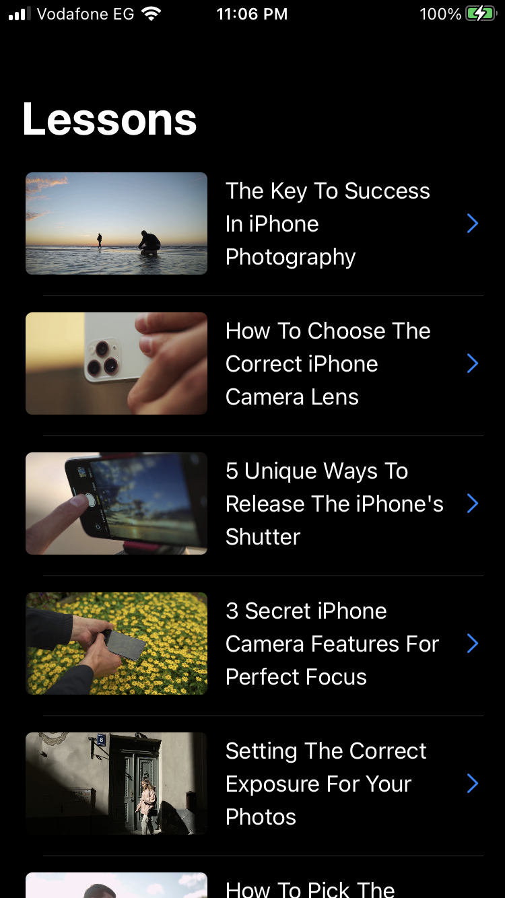
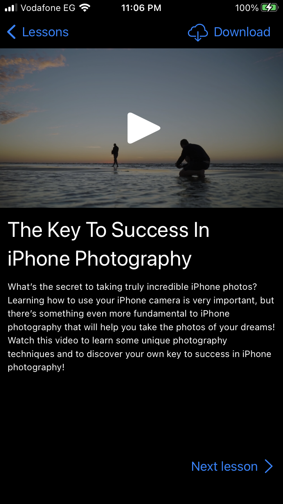
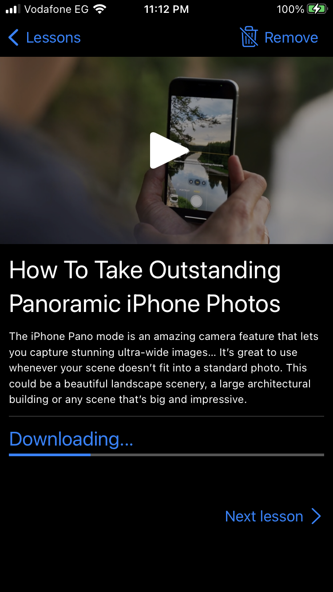
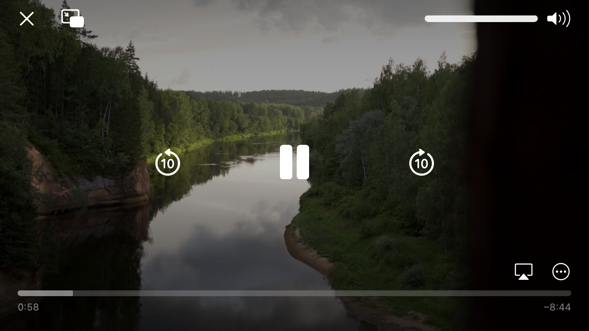

# Photography School Lessons

This repository contains an app has some lessons to teach people  photography.

## Screenshots





## Overview

This app follows horizontal hierarchy stracture, It's divided to several moduls:

###  Photography App

This modul is the app itself it contains three main screens and a very important component which is the download manager. 

#### Lessons List screen

This screen fetchs the lessons list from a Restful API and save that list into the app database and when there is no internet connection the screen shows the saved list from the database
This screen is written in [SwiftUI](https://developer.apple.com/documentation/swiftui/).

#### Lesson Details screen

This screen shows the lesson details it's thumbnail, title and  description.
You can download this lesson by clicking the the download button on the top right corned and once you do that a downloading progress bar will show at the bottom of the screen and you can cancel the download by clicking at the same button but this time it will show a word remove as a text for the button  

This screen gives you an option to play the lesson video by clicking the play button which exist on the top of the thumbnail image.
This screen holds a refrence for the next lessons and you can open the next lesson details screen by clicking Next lesson button

This screen is written in [UIKit](https://developer.apple.com/documentation/uikit).


#### Player screen

This screen plays a lesson but first it checks if the video is downloaded if yes the player will play the lesson from a local url otherwise it will play it from the remote url.

This screen is written in [UIKit](https://developer.apple.com/documentation/uikit).

#### Download Manager

This controller manages the download of the lessons when the user clicks the download
It manages downloading from the server, saving the downloaded lesson in a directory on the device and it saves the lcoal url to the videos to the database
It also manages removing the video from database, the saved video on the device stop the downloading if it's still being downloaded.

This controllers all do of that on a background queue but there is a limitation to it you can only download  one lesson at a time, when you click download button the controllers at the video to it's queue and it will schedule a download task for one video and when the download is finished it will start the next one.

User can still cancel the downlaod proccess even if the video still in the queue and doesn't started yet and in that case the controller won't start download it after the current downloading finishs.

This controller also runs once the appication starts running and check if there is any lessons waiting to be downlaoded then a task to download them if needed.


### AppDatabase Modul

[Read more](https://github.com/cyberwolf93/PhotographySchoolLessonApp/tree/main/PhotographySchoolLessonApp/AppDataBase)

### ClientAPI Modul

[Read more](https://github.com/cyberwolf93/PhotographySchoolLessonApp/tree/main/PhotographySchoolLessonApp/ClientAPI)

### AppModels Modul

[Read more](https://github.com/cyberwolf93/PhotographySchoolLessonApp/tree/main/PhotographySchoolLessonApp/AppModels)

## Installation

First you need to clone this repository using the following
```bash
git clone https://github.com/cyberwolf93/PhotographySchoolLessonApp.git
```

After that you navigate inside the PhotographySchoolLessonApp directory and make sure you have CocoaPods installed if not run the next command
 ```bash
sudo gem install cocoapods
```

Then run 
 ```bash
 Pod install
```

Now you are ready to run the app just double click the workspace named PhotographySchoolLessonApp
make sure to choose a developer team then run it on a real device with and iOS version 15+

## Tech stack

[XCode](https://developer.apple.com/documentation/xcode)
[Swift](https://docs.swift.org/swift-book/LanguageGuide/TheBasics.html)
[SwiftUI](https://developer.apple.com/documentation/swiftui/)
[UIKit](https://developer.apple.com/documentation/uikit)
[Combine](https://developer.apple.com/documentation/combine)
[CocoaPods](https://cocoapods.org/)
[CoreData](https://developer.apple.com/documentation/coredata)
[XCTest](https://developer.apple.com/documentation/xctest)


## Future Plans

### Download while the app in the back ground

This feature was implemented in this [commit](https://github.com/cyberwolf93/PhotographySchoolLessonApp/commit/78cf94f466b7d6c421078c0f4e09f84a2ae22dfe) but it was removed due to an issue because the app only download one session at a time, right now the app downloads lessons in foreground only.

### Download multible video upon configuration

### Better navigation design
The idea is to build a modul only for navigation and all app's screen go to that navigation modul for navigation, this abroach is better for scalability.

### Add more meaningful comments specially For test cases

## Tesing

This app has unit tests using XCTest with 54.1% coverage wich cover all view models and download manager.
Download manager has 98.2% coverage
 

